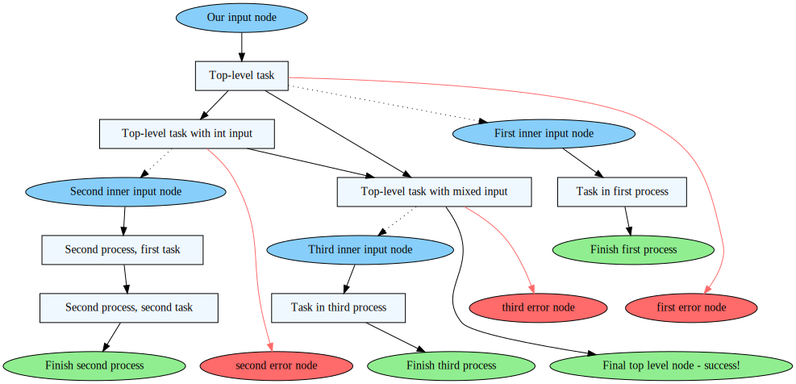

# ProcFlow

A project for automating mapping of system behaviour into process modelling notation.

| :warning:  WARNING            |
|-------------------------------|
| Project currently heavily WIP |


## Quickstart
### Installation

Don't. Not yet.


### Sample

```go
func NestedProcess(ctx context.Context, input int) (output int, err error) {
	// A process somewhere inside business process execution systems
	tracker := graph.RegisterTracker(ctx)
	defer tracker.CloseTrace()
	ctx, nodeStart := graph.Start(ctx, &tracker, "start-node", "Records process entrypoint")

	ctx, node1 := graph.Task(ctx, &tracker, []graph.Node{nodeStart}, "task-node", "Task in first process")

	output, err = CallService(ctx, input)
    if err != nil {
        isError := true
        graph.End(&tracker, []graph.Node{node1}, "error-node", "Records failed branch", isError)
    }

    isError := false
	graph.End(&tracker, []graph.Node{node1}, "end-node", "Records successful completion and return", isError)
	return
}
```

Modify `TestMain` to initialise the trackers (see below) and run `go test . -recordflow` to generate output

### External Dependencies

- Golang `graph` library: https://github.com/dominikbraun/graph
- `graphviz` to render output files


## Motivation

One of the central challenges of code and system maintenance is documentation. Previously, keeping documentation up to date was error-prone and reactive, with little recourse if failures in the docs emerged. Many frameworks now exist to streamline the documentation process, with self-documenting code as the industry standard. Issues still occur, but at far lower frequency than in the past.

However, docstrings do not tell the whole story. In codebases with complex business logic or high degrees of reusability, tracing the exact flow of a program can become a challenge that docstrings only partially assist. Modelling frameworks such as BPMN were developed to help make sense of complex systems and describe the process flow of a system. This is a less-granular view of how a system behaves, but performs the role of a high-level overview that has the advantage of being simpler to understand for non-expert users.

In practice, system diagrams fall into the same hole as documentation did in the past. With the exception of frameworks that are BPMN-first (Camunda/Zeebee etc.) and the simpler DAG charts produced by workflow tools (Airflow etc.), there is a lack of documentation for general-consumption program flow. System diagrams quickly fall out of concordance with the target system unless the team is using a system diagram as a fairly strict blueprint, and this constraint smacks of BDUF.

Problems arise when the plan, rather than the system, is treated as the source of truth.

This package steps into this gap and attempts to reverse the dependency. Our systems should not reflect diagrams, diagrams should reflect our systems. If our system is dynamic, our documentation should reflect that.

### Use Case

This tool is designed to "map" how your process logic actually executes, stripped of non-essential implementation details. It is designed to map the flow from task to task, without having to manually create the maps yourself.

The plan is to use unit and integration tests to call every branch of your logic (you have been writing tests, right?), then aggregate the fragmented views into a unified whole.

### What This Is Not

This is not a tool for every application. This is a tool for "business logic"-centric services that primarily orchestrate other tasks, where orchestration is more important than raw cycle time.

This is not a monitoring tool. This system can be considered an extension of application traces provided by Jaeger/New Relic/Data Dog, but does NOT replace them. There are plans to supplement these features in future.

This is not a call graph. You have call graphs to serve as call graphs. However, if you find call graphs too granular and want to aggretate it up into meaningful chunks, then maybe this is for you.

## Worked Example
Lets begin with a bit of dummy business logic. We are going to design a simple set of functions that pass around basic types. This is a deliberate simplification; in reality we're going to want to be calling out to microservices, writing to DBs, enacting saga patterns, etc. If it helps, we can use our imaginations and pretend we're doing more than a glorified `hello_world.go`.

The complete example can be found in `flow_integration_test.go`.

Let's say we've written the following test case for a process `proc1`. We want to use the integration test to make sure all our core processing and error handling logic works as expected, and that nothing slips though. Because this is a demo, we'll also assume that the process fails on some set on inputs (in this case, the integer passed in). Our test might look a little something like this:

```go
package mypackage_test

import (
	"context"
	"testing"

	"github.com/stretchr/testify/assert"
)


func TestDemoFlow(t *testing.T) {
	t.Run(
		"test node name conversion functions",
		func(t *testing.T) {
			ctx := context.Background()
			for idx := 0; idx < 4; idx++ {
				err := proc1(ctx, idx)
				if idx == 3 {
					assert.Nil(t, err)
					continue
				}
				assert.NotNil(t, err)
			}
		},
	)
}
```

Ignoring TDD for a moment, we're now going to build up to a passing test. We start with our service callouts. These are simple functions that, in a production system, could be much more complicated values. Let's start there.

```go
package mypackage_test

import (
	"context"
)

func returnInt(context.Context) int {
	return 1
}

func int2string(context.Context, int) string {
	return "a string"
}

func string2string(context.Context, string) string {
	return "another string"
}

func mixEmUp(context.Context, int, string) {
	// In the tradition of the Black Pearl, takes what it can and gives nothing back
}
```

### Dummy Process Logic
Now we have our services written up, let's build 3 processes that coordinate these services into business subprocesses. Again, in reality the logic involved would be a bit more complicated.

```go
package mypackage_test

import (
	"context"
)


func proc1func1(ctx context.Context) (int, error) {
    // Fake some logic in here
	aNumber := returnInt(ctx)

	return aNumber, nil
}

func proc1func2(ctx context.Context, input int) (string, error) {
	// Fake more nodes
	out1 := int2string(ctx, input)

	out2 := string2string(ctx, out1)

	return out2, nil
}

func proc1func3(ctx context.Context, inputInt int, inputStr string) error {
	// More dummy input
	mixEmUp(ctx, inputInt, inputStr)

	return nil
}
```

We will take these 3 processes and tie them into our main business process, and thus satisfy the unit test:

```go
package procflow_test

import (
	"context"
	"errors"
)


func proc1(ctx context.Context, willFailOn int) error {
	// No error branches should fail without our input

	out1, err := proc1func1(ctx)
	if err != nil || willFailOn == 0 {
		return errors.New("error1")
	}

	out2, err2 := proc1func2(ctx, out1)
	if err2 != nil || willFailOn == 1 {
		return errors.New("error2")
	}

	err3 := proc1func3(ctx, out1, out2)
	if err3 != nil || willFailOn == 2 {
		return errors.New("error3")
	}

	return nil
}

```

This straightforward example is all trivial to understand. But what happens when the logic gets convoluted? When the system state gets tangled? When you're not sure if you're hitting all branches of your code, or multiple layers of abstraction mean that process logic is multiple layers deep? This is the problem we want to set out to solve. By decorating with `procflow` tracking annotations, it becomes possible to record the structure of the process logic. In essence we use unit testing to assist in visibility for both devs and product owners.

### Adding Flow Tracking
The current system is a little verbose, but it is relatively straightforward. First, we initiate a tracker object (in this case, a `graph` tracker) and `defer` its closure with `defer tracker.CloseTrace()`. Next, we instantiate some `Start` nodes to record an entrypoint into our program. Then, we proceed through our program annotating with `Task` or `End` (return value or error, as appropriate), propagating the context each time. Here's how the `proc1` function looks after annotation:

```go
package procflow_test

import (
	"context"
	"errors"

	"github.com/Oracen/procflow/annotation/graph"
)

// Current mode is ugly and manual, but we need to start somewhere
func proc1(ctx context.Context, willFailOn int) error {
	// No error branches should fail without our input
	tracker := graph.RegisterTracker(ctx)
	defer tracker.CloseTrace()

	ctx, nodeStart := graph.Start(ctx, &tracker, "input", "Our input node")

	ctx, node1 := graph.Task(ctx, &tracker, []graph.Node{nodeStart}, "intermediate", "Top-level task")
	out1, err := proc1func1(ctx)

	if err != nil || willFailOn == 0 {
		graph.End(&tracker, []graph.Node{node1}, "error", "first error node", true)
		return errors.New("error1")
	}

	ctx, node2 := graph.Task(ctx, &tracker, []graph.Node{node1}, "intermediate2", "Top-level task with int input")
	out2, err2 := proc1func2(ctx, out1)
	if err2 != nil || willFailOn == 1 {
		graph.End(&tracker, []graph.Node{node2}, "error2", "second error node", true)
		return errors.New("error2")
	}

	ctx, node3 := graph.Task(ctx, &tracker, []graph.Node{node1, node2}, "intermediate3", "Top-level task with mixed input")
	err3 := proc1func3(ctx, out1, out2)
	if err3 != nil || willFailOn == 2 {
		graph.End(&tracker, []graph.Node{node3}, "error3", "third error node", true)
		return errors.New("error3")
	}
	graph.End(&tracker, []graph.Node{node3}, "finish", "Final top level node - success!", false)
	return nil
}
```

Yes, it's a little verbose, it's early days. Let's break down a few things:
- Context is passed into the handler constructor, but is not propagated. This is because `procflow` checks context for evidence of a parent flow, and uses this to structure the final graph. If no parent is found, `procflow` assumes the process is operating in the global context
- `graph.Start` denotes the point at which input comes into the function. In other processes, this may include things like `channels` or shared state
- `graph.Task` is a catchall for function calls. Both `Task` and `Start` update the context as the context can be propagated to child processes
- As `graph.End` denotes a return value, no context is propagated
- Both `End` and `Task` accept node inputs from other annotations, reflecting the dependency structure of the functional arguments. `Start` does not assume a parent node.

At this point, we likewise decorate our process logic. In the name of space efficiency I've ommitted a full illustration of that process. Feel free to check `flow_integration_test.go` to see the full example.

### Tying Recorder Into Testing
For now, the way this tool links into testing is through test setup/teardown. By default, state isn't tracked but keys are propagated for e.g. debug purposes. To enable recording, add the following setup/teardown logic into your `TestMain` function:

```go
package mypackage_test

import (
	"os"
	"testing"

	"github.com/Oracen/procflow"
)

func TestMain(m *testing.M) {
	var recordFlow bool
	flag.BoolVar(&recordFlow, "recordflow", false, "use unit tests to measure program process flow")
	flag.Parse()

	procflow.StartFlowRecord(recordFlow)
	exitVal := m.Run()
	if exitVal == 0 {
        // If you only want to record on success, else `defer` may be better
		procflow.StopFlowRecord(recordFlow, "./output_dir")
	}

	os.Exit(exitVal)
}
```

Run tests as usual, but add the `-recordflow` flag to enable the tracking system i.e `go test ./... -recordflow`. Setting this flag will yield a `graph.gv` file that shows the traced service logic.

### Output
After running `dot -Tsvg -O ./output_dir/graph.gv` to parse the raw `.gv` file from `graphviz` to `svg`, we end up with the following diagram:


<!--  -->

And that's...

Well, it's a start.

Obviously the current rendering engine isn't 100%, and relying on Graphviz to do the heavy lifting of presenting a program flow is never going to end well. Eventually this program will support more program logic-oriented rendering schemes (such as BMPN), but that is yet to be released.

## Notes
### Planned Features
- [ ] BPMN notation for output graphs
- [ ] Streamlined test integration
- [ ] High-level decorator abstractions to simplify code annotation
### Program Architecture
Some of the abstractions I've chosen are a little hacky, in particular the use of a Singleton pattern for state management. There are also some gaps that will need to be addressed later such as decorator patterns to turn this lib into middleware. I'm also aware more public APIs are exposed than are likely strictly necessary.s

I'm pretty new to Golang so any advice around how to improve the code quality would be appreciated.


